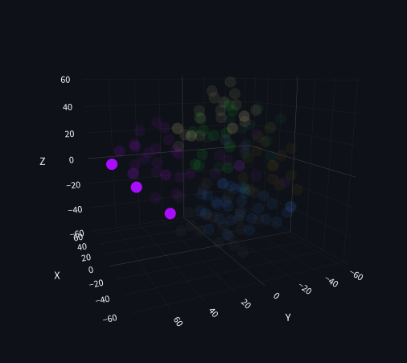

# PubTrends: Data Insights for Enhanced Paper Relevance


**JetBrains Summer Internship 2025 project**

PubTrends is a web application that visualizes how datasets from the GEO database (GSE) related to the same medical article (PMID) are distributed in a 3D space based on semantic similarity.

The app accepts a `.txt` file as input, containing a list of **PMIDs** of interest:

```text
30530648
31820734
31018141
38539015
33763704
32572264
31002671
33309739
21057496
...
```
## Data Retrieval Endpoints

The application uses NCBI's **e-utils API** and GEO data sources:

1. **Retrieve datasets linked to a given PMID:**

   `https://eutils.ncbi.nlm.nih.gov/entrez/eutils/elink.fcgi?dbfrom=pubmed&db=gds&linkname=pubmed_gds&id={pmid}&retmode=json`

   This URL provides a list of datasets linked to a given article.

2. **Fetching detailed information about the datasets:**

   `https://eutils.ncbi.nlm.nih.gov/entrez/eutils/esummary.fcgi?db=gds&id={dataset_id}&retmode=json`

   Based on each dataset's ID, we can retrieve information such as:
   - `Title`
   - `Summary`
   - `Organism`
   - `Experiment_type`
   
   However, to get the **Overall Design** field, we need to query another source:

3. **Fetching Overall Design information:**

   `https://www.ncbi.nlm.nih.gov/geo/query/acc.cgi?acc={gse_code}&form=xml`

   This URL provides the required **Overall Design** data.

 If a PMID has no associated GEO datasets, it is automatically skipped.

---

## Data Preprocessing steps

1. Clean and preprocess fields:  
`Title`, `Summary`, `Organism`, `Experiment type`, `Overall design`.

2. Construct a combined text string for each dataset.

3. Vectorize all dataset descriptions using **TF-IDF**.

4. Reduce vector space to 3D with **t-SNE**.

5. Cluster the datasets based on vector proximity.

6. Render a 3D interactive plot.  
Selecting a specific PMID will highlight all associated datasets on the plot.
<p align="center">
  <br>
  <em>Highlighted data points represent GSE datasets related to the same PMID.</em>
</p>

## Installation Guide (Windows)
#### Cloning Repository
```
git clone https://github.com/bzabk/PubTrends.git
cd PubTrends
```
#### Create a Virtual Environment
```
python -m venv venv
.\venv\Scripts\activate
```
#### Installing dependencies
```
pip install -r requirements.txt
```
#### Running application
```
streamlit run .\main.py    
```

## Installation Guide (Linux)
#### Cloning Repository
```
git clone https://github.com/bzabk/PubTrends.git
cd PubTrends
```
#### Creating a Virtual Environment
```
python3 -m venv venv
source venv/bin/activate
```
#### Installing dependencies
```
pip install -r requirements.txt
```
#### Running application
```
streamlit run main.py
```